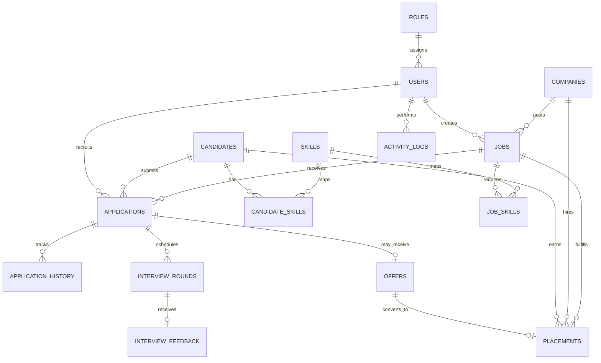

# RPMS ER Diagram (Mermaid)

```mermaid
erDiagram
 ROLES ||--o{ USERS : assigns
 USERS ||--o{ JOBS : creates
 USERS ||--o{ APPLICATIONS : recruits
 CANDIDATES ||--o{ CANDIDATE_SKILLS : has
 SKILLS ||--o{ CANDIDATE_SKILLS : maps
 COMPANIES ||--o{ JOBS : posts
 JOBS ||--o{ JOB_SKILLS : requires
 SKILLS ||--o{ JOB_SKILLS : maps
 CANDIDATES ||--o{ APPLICATIONS : submits
 JOBS ||--o{ APPLICATIONS : receives
 APPLICATIONS ||--o{ APPLICATION_HISTORY : tracks
 APPLICATIONS ||--o{ INTERVIEW_ROUNDS : schedules
 INTERVIEW_ROUNDS ||--o| INTERVIEW_FEEDBACK : receives
 APPLICATIONS ||--o| OFFERS : may_receive
 OFFERS ||--o| PLACEMENTS : converts_to
 CANDIDATES ||--o{ PLACEMENTS : earns
 COMPANIES ||--o{ PLACEMENTS : hires
 JOBS ||--o{ PLACEMENTS : fulfills
 USERS ||--o{ ACTIVITY_LOGS : performs
```
